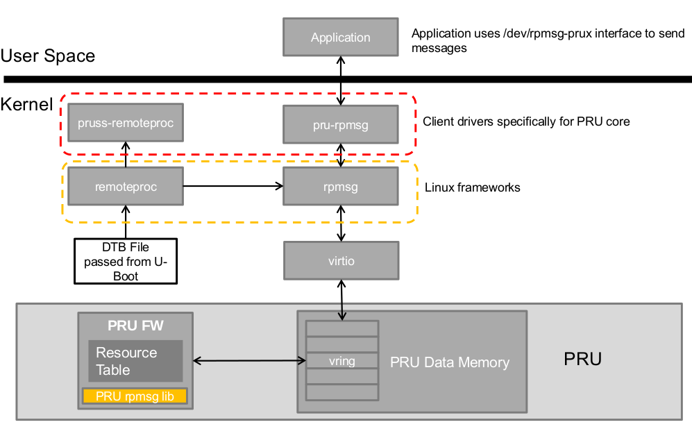

Thinking in virtio for autosar

AUTOSAR VIRTIO

Thinking in virtio for AUTOSAR
============
[TOC]

# *Prelog*
> A lot of times, I am thinking about software and how to be a good programer. But it turns out that I am stupid, I am not the guy who are smart than others. So I have a decision to learn harder, use the perfect open-source software developed by others to create a my self owened Automotive Software, also, I will make it source open.

> As now I think virtualization is a perfect way to develop our application when hardware is not ready, and the most important point is that it is much easier to debug and reduce the time of software develop phase. So I am alwasys trying to find a way to do the purpose better and better. I have tried to simulate CAN network by socket, to simulate OS by host OS thread and event simulate DIO LCD..etc through GTK or QT, as my limited ability, I can't make it running well, I am always thinking...

> Now I have came up an idea that build the ECU simulated software to dynamic link library(*.dll/*.so), and then load by host Qt daemon simulation manager software, I have tried it both in windows and linux, so it has been proven out perfect.

> So question came how to do the data exchange between the ECUs and Qt daemon, the most easiest and perfect way is through callouts and callbacks, but recently I am studying virtio, I think it is good and I am attracted by its idea. As some how my work is to do simualtion of AUTOSAR software environment(VFB-Virtual Function Bus), so I think virtio is a good way, I can lean it aslo and do the work at the same time.
> Then on I go deep into linux virtio source code, by it turns out very difficult to understand as I have no base knowledge of Linux Driver System, I can't know how it works. By reading articles searched from google, it seems that I have gotten some points. So I begins.

> Now on, it is already a month, but no big progressing, so I think I should write something to analyse the virtio and then move on.

# *TODO*
> 1. Investigate how the virtio&remoteproc works on ECU side, this is host virtio, refer code of [qemu][1].
> 2. Investigate how the virtio&remoteproc works on QT side, this is guest virtio, refer code of [linux][2].
> 3. There are variant numbers of ECUs as host, but only one QT guest, the guest should take care of the communicaton between hosts, for example CAN.

# 1. remoteproc 
> If you look into virtio, you will know that remote processor is based on virtio, you can check both [remoteproc][3] and [virtio][4], OK, when you check it really, you will find out that the virtio PDF didn't say any thing about remote processor, I think the mainy reason is that the virtio is mainly used and designed for virtual machines, such as qemu/vmare and virtualbox...etc. If you check the [remoteproc][5] description, you will know that yes, the remoteproc is based on virtio and mainly for [rpmsg][6], so the rproc is mainly for AMP(asymmetric
multiprocessing) ECUs firstly introduced by TI OMAP platform. So by generally the architecture of remoteproc looks as below,the information is copied from [Enhancing RT Capabilities with the PRU final.pdf][7] on page 23:
   

  [1]: http://git.qemu.org/?p=qemu.git;a=tree
  [2]: https://git.kernel.org/cgit/linux/kernel/git/torvalds/linux.git/tree/?id=refs/tags/v4.3-rc1
  [3]: https://www.kernel.org/doc/Documentation/remoteproc.txt
  [4]: http://docs.oasis-open.org/virtio/virtio/v1.0/csprd01/virtio-v1.0-csprd01.pdf
  [5]: https://www.kernel.org/doc/Documentation/remoteproc.txt
  [6]: https://www.kernel.org/doc/Documentation/rpmsg.txt
  [7]: http://events.linuxfoundation.org/sites/events/files/slides/Enhancing%20RT%20Capabilities%20with%20the%20PRU%20final.pdf